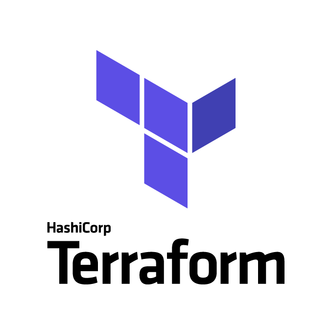

# LINDS-Terraform



## Intro

Uses [vSphere terraform provider](https://registry.terraform.io/providers/hashicorp/vsphere/2.2.0) to provision VM's, Host Port Groups, Datastore.

For Proxmox I use [bpg/proxmox](https://registry.terraform.io/providers/bpg/proxmox/latest)

[Packer](https://www.packer.io/) to create the VM template of CentOS images, which is then cloned per ESXi host and Proxmox host.

## Packer

### Vsphere

1. Change to packer directory

```shell
$ cd packer/
```

2. Fill in `packer/vars.auto.pkrvars.hcl.example` and rename it to `packer/vars.auto.pkrvars.hcl`.

Example:
```
vsphere_server   = "jd-vsca-01.linds.com.au"
vsphere_user     = "administrator@vsphere.local"
vsphere_password = "xxxxxxxxxx"
datacenter       = "LINDS"
datastore        = "JD-Datastore-OS"
network_name     = "Native VLAN"
host             = "jd-esxi-01.linds.com.au"
ssh_password     = "xxxxxxxxxx"
```

3. In the designated datastore, copy [CentOS 9 Stream ISO](https://mirrors.centos.org/mirrorlist?path=/9-stream/BaseOS/x86_64/iso/CentOS-Stream-9-latest-x86_64-dvd1.iso&redirect=1&protocol=https) to `<datastore>/ISO/CentOS-Stream-9.iso` and [CentOS 8 Stream ISO](http://isoredirect.centos.org/centos/8-stream/isos/x86_64/) to `<datastore>/ISO/CentOS-Stream-8.iso`

4. Run the below command to build and provision both CentOS 9 and CentOS 8.

```shell
$ cd packer/
$ packer build -force .
```

**To build only CentOS 8:**

```shell
$ packer build -var-file=vars.auto.pkrvars.hcl -only=vsphere-iso.centos8 -force .
```

**To build only CentOS 9:**

```shell
$ packer build -var-file=vars.auto.pkrvars.hcl -only=vsphere-iso.centos9 -force .
```

### Proxmox


**To build CentOS 9 on proxmox**

1. Copy and rename variables-proxmox.pkrvars.hcl.example to variables-proxmox.pkrvars.hcl and fill in variables

2. Run the below command
```shell
cd packer && packer build -var-file=packer_jd.pkrvars.hcl -only=proxmox-iso.centos-9 -force . 
```

**To build Ubuntu Server 2024 on proxmox**

1. Run the below command
```shell
cd packer && packer build -var-file=packer_jd.pkrvars.hcl -only=proxmox-iso.ubuntu -force .
```

## Terraform

### vSphere

1. Copy and rename [terraform.tfvars.example](/terraform.tfvars.example)

Example:
```
vsphere_server      = "xxxx"
vsphere_user        = "xxxx"
vsphere_password    = "xxxx"
datacenter          = "xxxx"
jd-datastore        = "xxxx"
jd-host             = "xxxx"
linds-host          = "xxxx"
linds-datastore     = "xxxx"
jd_network_name     = "xxxxxxx"
jd_centos_9         = "CentOS 9"
jd_centos_8         = "CentOS 8"
linds_centos_9      = "CentOS 9-LINDS"
linds_centos_8      = "CentOS 8-LINDS"
host_licensekey     = "xxxxx-xxxxx-xxxxx-xxxxx-xxxxx"
```

2. Initialise Terraform and apply configuration

```shell
$ terraform init

$ terraform plan

$ terraform apply
```
#### State

State is kept on TrueNAS NFS share, that is then rsync'd to secondary TrueNAS offsite. This can be seen in [versions.tf](/versions.tf).

### Proxmox

1. Switch to proxmox directory

`cd proxmox/`

2. Copy and rename [terraform.tfvars.example](/proxmox/terraform.tfvars.example)

3. Copy and rename [backend.conf.example](/proxmox/backend.conf.example) to `backend.conf` and fill in your MinIO/S3 credentials.

4. Initialise Terraform and apply configuration

```shell
$ terraform init -backend-config=backend.conf
$ terraform plan -var-file proxmox_jd_terraform.tfvars
$ terraform plan -var-file proxmox_linds_terraform.tfvars
```


### Talos

#### Upgrading the Talos machine image on running nodes

Talos OS upgrades are performed in-place via `talosctl upgrade`. The installer image URL is composed of a schematic ID (from Terraform state) and the target Talos version.

**Step 1 — Get the schematic IDs from Terraform state**

```shell
cd proxmox/
# AMD schematic (JD nodes — EPYC 7B13 / Zen 3)
terraform state show talos_image_factory_schematic.amd | grep "id "

# Intel schematic (LINDS nodes — Xeon E5 v4 / Broadwell)
terraform state show talos_image_factory_schematic.intel | grep "id "
```

**Step 2 — Upgrade worker nodes first, control plane last**

Replace `<TALOS_VERSION>` with the target version (e.g. `v1.13.4`) and use the schematic IDs from Step 1.

JD workers (AMD — 10.0.53.201, 10.0.53.202, 10.0.53.203):
```shell
export TALOSCONFIG=proxmox/talosconfig
AMD_SCHEMATIC=$(terraform -chdir=proxmox state show talos_image_factory_schematic.amd | awk '/id / {print $3}' | tr -d '"')
TALOS_VERSION=v1.13.4

for node in 10.0.53.201 10.0.53.202 10.0.53.203; do
  talosctl upgrade --nodes $node \
    --image factory.talos.dev/installer/${AMD_SCHEMATIC}:${TALOS_VERSION} \
    --wait
done
```

LINDS workers (Intel — 10.3.1.100, 10.3.1.101):
```shell
INTEL_SCHEMATIC=$(terraform -chdir=proxmox state show talos_image_factory_schematic.intel | awk '/id =/ {print $3}' | tr -d '"')

for node in 10.3.1.100 10.3.1.101; do
  talosctl upgrade --nodes $node \
    --image factory.talos.dev/installer/${INTEL_SCHEMATIC}:${TALOS_VERSION} \
    --wait
done
```

JD control plane (AMD — 10.0.53.200, upgrade last):
```shell
talosctl upgrade --nodes 10.0.53.200 \
  --image factory.talos.dev/installer/${AMD_SCHEMATIC}:${TALOS_VERSION} \
  --wait
```

**Step 3 — Verify all nodes**

```shell
talosctl version --nodes 10.0.53.200,10.0.53.201,10.0.53.202,10.0.53.203,10.3.1.100,10.3.1.101
```

#### Destroying Talos VMs

```shell
terraform destroy -var-file=proxmox_jd_terraform.tfvars -target=proxmox_virtual_environment_vm.talos_cp -target=proxmox_virtual_environment_vm.talos_worker
```

Run it twice, reboot nodes after second run.