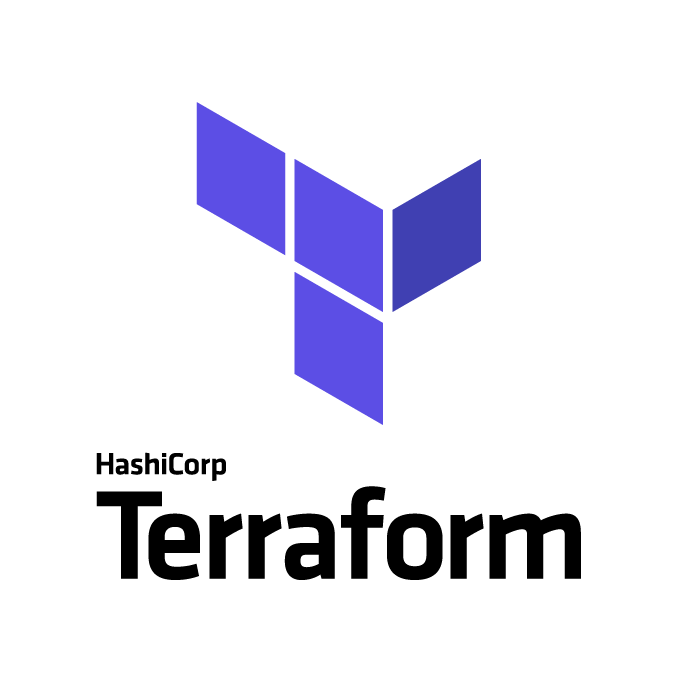

# LINDS-Terraform



Infrastructure for a two-site homelab: a Proxmox host at each site, a Talos
Kubernetes cluster spanning both, and the storage underneath it.

| Directory | What it manages |
| --- | --- |
| [`proxmox/`](proxmox/) | `jd-proxmox-02` end to end (guests, networking, storage, ZFS/NFS) plus the LINDS guests and the Talos/Cilium cluster |
| [`bootstrap/`](bootstrap/) | The MinIO container that serves the S3 state backend. Separate root module with local state — see below |
| [`packer/`](packer/) | The Ubuntu LTS template every cloned guest comes from |
| [`ESXi/`](ESXi/) | Legacy vSphere config, kept for reference; not in active use |

## Sites

**JD** — `jd-proxmox-02` (10.0.50.246). AMD EPYC 7B13, 251 GiB RAM, three ZFS
pools. Runs the control plane, three Talos workers, the VyOS router, a Windows
DC and assorted guests.

**LINDS** — `linds-proxmox-01` (192.168.6.205). Intel Xeon E5 v4. Two Talos
workers plus Plex and a torrent box. Joined to JD over an IPsec tunnel between
the two VyOS routers.

Cilium runs in native routing mode and BGP-peers with each site's VyOS router
(ASN 64512 at JD, 64513 at LINDS) to advertise PodCIDRs and the LoadBalancer
pool.

## State, and the chicken-and-egg problem

`proxmox/` keeps its state in a MinIO bucket. MinIO runs as LXC 106 on
`jd-proxmox-02` — the host `proxmox/` manages. Managing that container from the
same module would make a cold start impossible and let a replace eat its own
state mid-apply.

So the container lives in [`bootstrap/`](bootstrap/), a separate root module
with **local** state, marked `prevent_destroy`, with an `import` block that
re-adopts the running container if the state file is ever lost. Read
[`bootstrap/README.md`](bootstrap/README.md) before touching it.

## Packer

One build, the current Ubuntu LTS, from a downloaded ISO.

```shell
cd packer/
cp packer_jd.pkrvars.hcl.example packer_jd.pkrvars.hcl   # then fill it in
packer init .
packer build -var-file=packer_jd.pkrvars.hcl .
```

Bumping to the next LTS is `ubuntu_version` + `iso_url` + `iso_checksum` in
`variables.pkr.hcl`. Checksums come from
`https://releases.ubuntu.com/<version>/SHA256SUMS`.

The template VMID (`template_vm_id`, default 150) must match
`ubuntu_template_vm_id` in `proxmox/locals.tf` — that is what cloned guests
reference.

Secrets are better passed as `PKR_VAR_proxmox_password` / `PKR_VAR_ssh_password`
than written into the vars file.

## Terraform

```shell
cd proxmox/
cp terraform.tfvars.example terraform.tfvars     # then fill it in
cp backend.conf.example backend.conf             # MinIO credentials

terraform init -backend-config=backend.conf
terraform plan
```

Both sites are configured in the one module via a second aliased provider;
there is no per-site var file.

Prefer an API token over the root password:

```shell
pveum user token add root@pam terraform --privsep 0
```

then set `proxmox_api_token = "root@pam!terraform=<uuid>"`.

See [`proxmox/README.md`](proxmox/README.md) for the file layout and the
sharp edges.

## Talos

### Upgrading the machine image on running nodes

Talos upgrades are in-place via `talosctl upgrade`. The installer image is a
schematic ID plus a version; both come from Terraform.

```shell
cd proxmox/
terraform output -json talos_installer_images
```

That prints the exact image reference per CPU vendor — `amd` for the JD nodes
(EPYC 7B13 / Zen 3), `intel` for the LINDS nodes (Xeon E5 v4 / Broadwell).

Workers first, control plane last:

```shell
export TALOSCONFIG=proxmox/talosconfig
AMD=$(terraform -chdir=proxmox output -json talos_installer_images | jq -r .amd)
INTEL=$(terraform -chdir=proxmox output -json talos_installer_images | jq -r .intel)

for node in 10.0.53.201 10.0.53.202 10.0.53.203; do
  talosctl upgrade --nodes $node --image "$AMD" --wait
done

for node in 10.3.1.100 10.3.1.101; do
  talosctl upgrade --nodes $node --image "$INTEL" --wait
done

talosctl upgrade --nodes 10.0.53.200 --image "$AMD" --wait
```

Verify:

```shell
talosctl version --nodes 10.0.53.200,10.0.53.201,10.0.53.202,10.0.53.203,10.3.1.100,10.3.1.101
```

To move to a new Talos release, bump `local.talos_version` in
`proxmox/talos.tf` and re-run the above. Note that the schematic ID is a hash of
the kernel-arg list in `proxmox/talos-schematic.tf` — reordering that list
silently changes the image on every node.

### Destroying Talos VMs

```shell
terraform destroy \
  -target=module.talos_cp_jd \
  -target=module.talos_workers_jd
```

Run it twice; reboot nodes after the second run.
