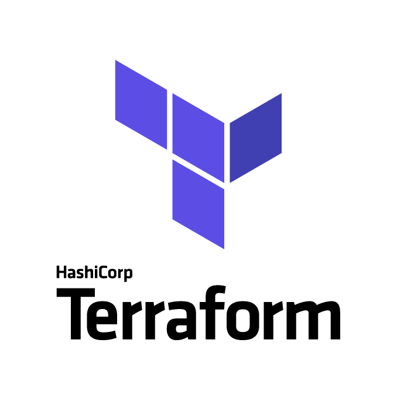

# LINDS-Terraform



Infrastructure for a two-site homelab: a Proxmox host at each site, a Talos
Kubernetes cluster spanning both, and the storage underneath it.

| Directory | What it manages |
| --- | --- |
| [`proxmox/`](proxmox/) | `jd-proxmox-02` end to end (guests, networking, storage, ZFS/NFS) plus the LINDS guests and the Talos/Cilium cluster |
| [`bootstrap/`](bootstrap/) | The MinIO container that serves the S3 state backend. Separate root module with local state — see below |
| [`packer/`](packer/) | The Ubuntu LTS template every cloned guest comes from |
| [`ESXi/`](ESXi/) | Legacy vSphere config, kept for reference; not in active use |

## Sites

**JD** — `jd-proxmox-02` (10.0.50.246). AMD EPYC 7B13, 251 GiB RAM, three ZFS
pools. Runs the control plane, three Talos workers, the VyOS router, a Windows
DC and assorted guests.

**LINDS** — `linds-proxmox-01` (192.168.6.205). Intel Xeon E5 v4. Two Talos
workers plus Plex and a torrent box. Joined to JD over an IPsec tunnel between
the two VyOS routers.

Cilium runs in native routing mode and BGP-peers with each site's VyOS router
(ASN 64512 at JD, 64513 at LINDS) to advertise PodCIDRs and the LoadBalancer
pool.

## State, and the chicken-and-egg problem

`proxmox/` keeps its state in a MinIO bucket. MinIO runs as LXC 106 on
`jd-proxmox-02` — the host `proxmox/` manages. Managing that container from the
same module would make a cold start impossible and let a replace eat its own
state mid-apply.

So the container lives in [`bootstrap/`](bootstrap/), a separate root module
with **local** state, marked `prevent_destroy`, with an `import` block that
re-adopts the running container if the state file is ever lost. Read
[`bootstrap/README.md`](bootstrap/README.md) before touching it.

## Packer

One build, the current Ubuntu LTS, from a downloaded ISO.

```shell
cd packer/
cp packer_jd.pkrvars.hcl.example packer_jd.pkrvars.hcl   # then fill it in
packer init .
packer build -var-file=packer_jd.pkrvars.hcl .
```

Bumping to the next LTS is `ubuntu_version` + `iso_url` + `iso_checksum` in
`variables.pkr.hcl`. Checksums come from
`https://releases.ubuntu.com/<version>/SHA256SUMS`.

The template VMID (`template_vm_id`, default 150) must match
`ubuntu_template_vm_id` in `proxmox/locals.tf` — that is what cloned guests
reference.

Secrets are better passed as `PKR_VAR_proxmox_password` / `PKR_VAR_ssh_password`
than written into the vars file.

## Terraform

```shell
cd proxmox/
cp terraform.tfvars.example terraform.tfvars     # then fill it in
cp backend.conf.example backend.conf             # MinIO credentials

terraform init -backend-config=backend.conf
terraform plan
```

Both sites are configured in the one module via a second aliased provider;
there is no per-site var file.

Prefer an API token over the root password:

```shell
pveum user token add root@pam terraform --privsep 0
```

then set `proxmox_api_token = "root@pam!terraform=<uuid>"`.

See [`proxmox/README.md`](proxmox/README.md) for the file layout and the
sharp edges.

## Talos

### Applying machine config and Cilium changes

Three targeted applies, in this order:

```shell
# 1. control plane: machine config, and on a Kubernetes bump the API server,
#    controller-manager and scheduler
terraform -chdir=proxmox apply -target=talos_machine_configuration_apply.controlplane

# 2. workers
terraform -chdir=proxmox apply \
  -target=talos_machine_configuration_apply.worker \
  -target=talos_machine_configuration_apply.worker_linds

# 3. Cilium release and its BGP / LB custom resources
terraform -chdir=proxmox apply \
  -target=helm_release.cilium -target=null_resource.cilium_bgp_config
```

Nothing reboots. Steps 1 and 2 restart the kubelet when its image changes, and
step 1 restarts the control plane pods on a Kubernetes bump, which is why it
goes first: kubelets must not run ahead of the API server. The targets pull in
what they depend on — the image factory schematic, the boot ISO and the VMs'
cdrom — and refresh the `talos_installer_images` output. Step 3 depends on the
control plane config, so it cannot run before step 1.

Use the targets rather than a bare `terraform apply`. An untargeted apply acts
on every guest in this module, including whatever else has drifted, and not
every VM sets `reboot_after_update = false`. Read `terraform plan` first if
you do want one.

The Cilium agents roll two at a time. Pulling the new images beforehand keeps
that short, but do it one node at a time on the JD site: the node disks and
etcd share one pool, and seven nodes pulling at once has stalled etcd long
enough for Talos to restart the API server.

```shell
talosctl --nodes 10.0.53.201 image pull --namespace cri quay.io/cilium/cilium:v1.20.2
```

### Upgrading the machine image on running nodes

Talos upgrades are in-place via `talosctl upgrade`. The installer image is a
schematic ID plus a version; both come from Terraform.

Bump `local.talos_version` in `proxmox/talos.tf` and run steps 1 and 2 above
first. That rewrites the installer reference in each node's config, downloads
the new boot ISO, and updates the output the next command reads.

Use a `talosctl` from the minor release the cluster is running now (`talosctl
version` prints both sides), which is what Sidero recommends for upgrades.

```shell
cd proxmox/
terraform output -json talos_installer_images
```

That prints the exact image reference per CPU vendor — `amd` for the JD nodes
(EPYC 7B13 / Zen 3), `intel` for the LINDS nodes (Xeon E5 v4 / Broadwell).
The two are currently the same image; see `proxmox/talos-schematic.tf`.

Workers first, control plane last:

```shell
export TALOSCONFIG=proxmox/talosconfig
AMD=$(terraform -chdir=proxmox output -json talos_installer_images | jq -r .amd)
INTEL=$(terraform -chdir=proxmox output -json talos_installer_images | jq -r .intel)

for node in 10.0.53.201 10.0.53.202 10.0.53.203 10.0.53.204; do
  talosctl upgrade --nodes $node --image "$AMD" --wait
done

for node in 10.3.1.100 10.3.1.101; do
  talosctl upgrade --nodes $node --image "$INTEL" --wait
done

talosctl upgrade --nodes 10.0.53.200 --image "$AMD" --wait
```

Verify:

```shell
talosctl version --nodes 10.0.53.200,10.0.53.201,10.0.53.202,10.0.53.203,10.0.53.204,10.3.1.100,10.3.1.101
```

`talosctl upgrade` cordons and drains each node first (5 minute drain timeout).
The CNPG primary is protected by a PodDisruptionBudget that blocks its eviction,
so switch it to the other instance before draining its node:

```shell
kubectl cnpg promote linds-postgres <other-instance> -n postgresql-linds
```

If an upgrade stops at `error pulling upgrade image`, the node could not reach
the image factory in time and is still on the old version, untouched. Pull the
installer onto it and run the upgrade again:

```shell
talosctl --nodes $node image pull --namespace system "$AMD"
```

Vault is sealed again whenever its pod restarts, which a drain of its node
does. It needs unsealing by hand afterwards.

To move to a new Talos release, bump `local.talos_version` in
`proxmox/talos.tf` and re-run the above. Note that the schematic ID is a hash of
the kernel-arg list in `proxmox/talos-schematic.tf` — changing that list changes
the image on every node.

### VM hardware changes need a cold start

CPU flags, cores, memory and the like are read when QEMU starts. The Talos VMs
set `reboot_after_update = false`, so `terraform apply` records such a change
as *pending* and restarts nothing. A reboot from inside the guest — `talosctl
reboot`, or the one `talosctl upgrade` performs — keeps the same QEMU process
and does not pick it up. The VM has to be powered off and started again.

Shut the node down from Talos and start it from Proxmox. `qm reboot` does the
same in one command, but for the Talos VMs it has failed more often than not
(`VM quit/powerdown failed` in the task log), and a failed `qm reboot` leaves
the VM off.

```shell
terraform -chdir=proxmox output vm_ids       # node name -> VMID
qm pending 102                               # on the Proxmox host: what is waiting

kubectl drain talos-worker-01 --ignore-daemonsets --delete-emptydir-data
talosctl --nodes 10.0.53.201 shutdown --force --wait   # --force: already drained
qm status 102                                # wait for "stopped"
qm start 102
kubectl wait --for=condition=Ready node/talos-worker-01 --timeout=10m
kubectl uncordon talos-worker-01
```

One node at a time, moving the CNPG primary first as above. To combine it with
a Talos upgrade under a single drain, run `talosctl upgrade --drain=false`
between the `kubectl wait` and the `uncordon`.

A pending change also lands by itself the next time the Proxmox host is
rebooted. To confirm the CPU flags in `locals.tf` (`talos_cpu_flags`) are live:

```shell
talosctl --nodes 10.0.53.201 read /proc/cpuinfo | grep -m1 -ow pcid
```

### Destroying Talos VMs

```shell
terraform destroy \
  -target=module.talos_cp_jd \
  -target=module.talos_workers_jd
```

Run it twice; reboot nodes after the second run.
